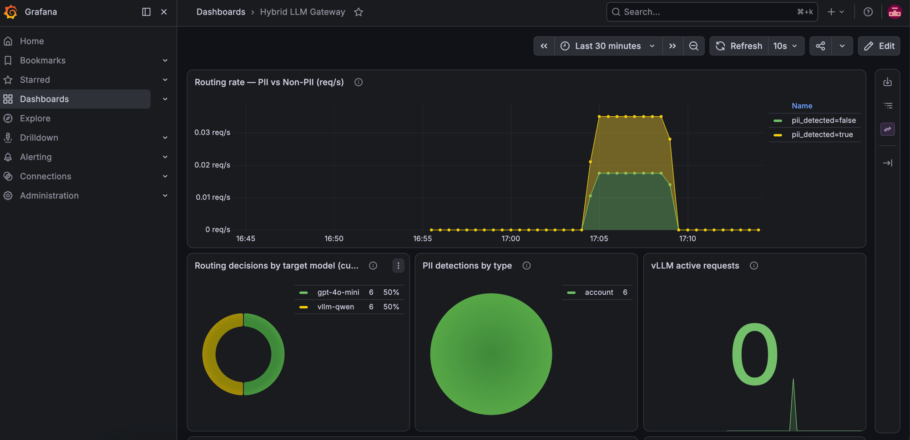

# pii-platform

**Compliance-aware hybrid LLM gateway on Kubernetes** — routes PII requests to a self-hosted vLLM backend and general traffic to commercial APIs, with cost & SLA observability.

> Route by data sensitivity, not by guesswork. Keep customer PII on-prem, send the rest to the best commercial model — all on Kubernetes.

---

## 문제 정의

금융권은 고객 PII·거래정보를 외부 LLM API로 못 보낸다 (컴플라이언스). 그렇다고 상용 API 품질도 포기 못 한다.

→ **민감도를 판별해 PII 요청은 사내 vLLM(온프레)으로, 일반 요청은 상용 API로 보내는 하이브리드 LLM 게이트웨이를 Kubernetes 위에 구축**하고 비용·SLA를 관측한다.

## 아키텍처

```
[Client / 데모 스크립트]
        │
        ▼
┌────────────────────────────────┐
│  FastAPI Service (K8s)          │  ← BFF / 서비스 레이어
│  · JWT 인증                     │
│  · PII 감지 + 마스킹            │
│  · 라우팅 결정 (model_name)     │
│  · 요청 로깅·메트릭             │
└────────────────┬───────────────┘
                 │ model_name 명시 후 forward
                 ▼
┌────────────────────────────────┐
│  LiteLLM Gateway (K8s)          │  ← 순수 LLM 라우팅
│  · 모델 → 백엔드 매핑            │
│  · retry / fallback             │
│  · cost tracking                │
└───────┬──────────────────┬─────┘
        │ vllm-qwen         │ gpt-4o-mini
        ▼                   ▼
┌──────────────┐    ┌──────────────────┐
│ vLLM (K8s,    │    │ 상용 API          │
│ CPU, 소형)    │    │ (OpenAI/Anthropic)│
│ = 온프레 처리 │    │ = 고품질 처리      │
└──────────────┘    └──────────────────┘
        │
        ▼
[Prometheus / Grafana]
  · 민감 vs 비민감 트래픽 비율
  · 클라이언트별 토큰 비용
  · p50 / p95 / p99 latency, 에러율
  · vLLM KV캐시 사용률·throughput
```

> **계층 분리:** FastAPI가 도메인 로직 (PII·auth·라우팅 결정), LiteLLM은 순수 LLM 어댑터. 관심사 분리로 각 계층의 확장 자유 확보.

## 기술 스택 & 도메인 정당성

| 기술 | 왜 있는가 |
|---|---|
| **FastAPI Service** | **서비스 레이어 / BFF** — PII·auth·라우팅 결정 등 도메인 로직 응집 |
| LiteLLM 게이트웨이 | 순수 LLM 어댑터 — model_name → 실제 백엔드 매핑, retry/fallback, cost tracking |
| **vLLM on K8s (CPU, 소형 모델)** | 민감정보를 **밖으로 안 보내고** 처리하는 온프레 백엔드 |
| PII 탐지 | 라우팅 **결정 로직** (한국어 정규식 + 옵션: Presidio) |
| BYOK / JWT 인증 | 팀·클라이언트별 접근 통제 |
| Prometheus / Grafana | **SLA·비용** 관측, 민감/비민감 트래픽 분리 |
| Kubernetes + HPA | 운영·스케일·self-healing |

**주요 스택:** `kind`, `Helm`, `kubectl`, FastAPI, LiteLLM, vLLM (CPU), Prometheus, Grafana (kube-prometheus-stack), Docker

## 데모 시나리오

"고객 상담 문의 처리"

- 계좌번호/주민번호가 든 문의 → **온프레 vLLM** 처리 (+ PII 마스킹)
- 일반 FAQ 문의 → **상용 API** 처리
- Grafana에서 **민감 vs 비민감 트래픽 비율·비용·latency를 한 화면**에 시각화

## 로드맵

| Day | 목표 | 산출물 |
|-----|------|--------|
| 1 | K8s 필수 확보 ⭐ (게이트웨이 배포) | kind 클러스터 + Helm 차트로 도는 LiteLLM |
| 2 | vLLM을 K8s에 배포 (온프레 백엔드) | CPU 모드 vLLM Deployment + Service |
| 3 | 민감도 라우팅 (도메인 핵심) | PII 감지 → vLLM / 미감지 → 상용 API |
| 4 | 관측성 (SLA·비용) | Grafana 대시보드 |
| 5 | 운영 티 + 문서화 | HPA, 롤백 시연, 아키텍처 다이어그램 |

> Day 1만 끝나도 K8s 필수요건은 확보. 뒤 날짜는 전부 우대 가산점 → 시간 밀려도 손해 최소.

## 스코프 & 트레이드오프

- **PII 탐지는 정규식 수준의 데모** — 핵심은 탐지 정확도가 아니라 "민감도로 라우팅을 가르는 아키텍처"
- **프론트엔드 없음** — 이 프로젝트의 "UI"는 Grafana 대시보드 + 아키텍처 다이어그램. LLM Ops 포지션은 백엔드·인프라를 봄
- **vLLM CPU 백업안** — CPU 이미지 빌드가 막히면 Colab GPU + `cloudflared` 터널로 전환. K8s 필수는 게이트웨이 배포로 이미 충족되어 있어 OK

## 상태

- [x] 계획 완료
- [x] **Day 1 — 게이트웨이 K8s 배포** ✅ (PR #2 머지, 2026-08-09) → [빠른 시작](#빠른-시작-day-1-완성분)
- [x] **Day 2 — vLLM 배포** ✅ (PR #3 머지, 2026-08-12) — CPU 모드로 Qwen2.5-0.5B-Instruct 서빙
- [x] **Day 3 — 하이브리드 라우팅** ✅ (PR #4 머지, 2026-08-13) — PII → 온프레 vLLM, 일반 → OpenAI
- [x] **Day 4 — 관측성** ✅ (Prometheus + Grafana) → [대시보드](#관측성-grafana-대시보드)
- [ ] Day 5 — 운영·문서화

## 관측성 (Grafana 대시보드)

`kube-prometheus-stack` + FastAPI 커스텀 메트릭(`pii_detections_total`, `routing_decisions_total`) + vLLM native 메트릭을 하나의 대시보드에 시각화. Dashboard-as-Code로 `deploy/grafana/hybrid-llm-dashboard.json`에 정의, ConfigMap sidecar로 Grafana에 자동 로드.



**핵심 패널:**

- **Routing rate — PII vs Non-PII** — `sum by (pii_detected) (rate(routing_decisions_total[5m]))` 스택드 뷰. 도메인 스토리 그 자체.
- **Routing decisions by target model** — vLLM vs OpenAI 누적 비율 (도넛)
- **PII detections by type** — 어떤 종류의 PII가 자주 감지되는지 (파이)
- **vLLM active requests / tokens/sec** — 온프레 백엔드 부하·처리량

접속:
```bash
kubectl port-forward -n monitoring svc/monitoring-grafana 3000:80
# http://localhost:3000/d/hybrid-llm-gateway (admin / admin123)
```

## 빠른 시작 (Day 1 완성분)

FastAPI + LiteLLM 2-service 하이브리드 게이트웨이를 로컬 kind 클러스터에 배포하고 스모크 테스트.

### 사전 요구

- macOS + Docker Desktop 실행 중
- `brew install kind kubectl helm`
- OpenAI API 키 ([발급](https://platform.openai.com/api-keys))

### 순서

```bash
# 1. 리포 세팅
git clone https://github.com/kingjiwoo/pii-platform && cd pii-platform
cp .env.example .env
# .env 파일 열어서 OPENAI_API_KEY=sk-... 채우기

# 2. kind 클러스터 생성
kind create cluster --config deploy/kind/kind-config.yaml

# 3. ingress-nginx Controller 설치
kubectl apply -f https://kind.sigs.k8s.io/examples/ingress/deploy-ingress-nginx.yaml
kubectl wait --namespace ingress-nginx \
  --for=condition=ready pod \
  --selector=app.kubernetes.io/component=controller \
  --timeout=120s

# 4. 이미지 빌드 + kind 노드로 로드
docker build -t pii-litellm:dev docker/litellm/
docker build -f docker/api/Dockerfile -t pii-api:dev .
kind load docker-image pii-litellm:dev --name pii-platform
kind load docker-image pii-api:dev --name pii-platform

# 5. 환경변수 로드 후 Helm 배포
set -a; source .env; set +a

helm install gateway ./deploy/helm/litellm \
  --namespace pii --create-namespace \
  --set secrets.OPENAI_API_KEY=$OPENAI_API_KEY

helm install gateway-api ./deploy/helm/api --namespace pii

# 6. Pod Ready 대기
kubectl rollout status deployment/gateway-litellm -n pii
kubectl rollout status deployment/gateway-api -n pii

# 7. End-to-end 스모크 테스트 (Ingress → FastAPI → LiteLLM → OpenAI)
./scripts/smoke-api.sh
# → ✅ SUCCESS — 4-hop 정상
```

### 검증되는 것

- ✅ 2-service Helm chart 각각 배포 (Deployment/Service/ConfigMap/Secret/Ingress)
- ✅ `checksum/config` annotation으로 ConfigMap 변경 자동 반영
- ✅ 외부 진입점은 FastAPI 하나로 통일, LiteLLM은 내부 전용 (ClusterIP)
- ✅ Ingress-nginx가 host 기반 라우팅 (`api.localtest.me` → gateway-api Service)
